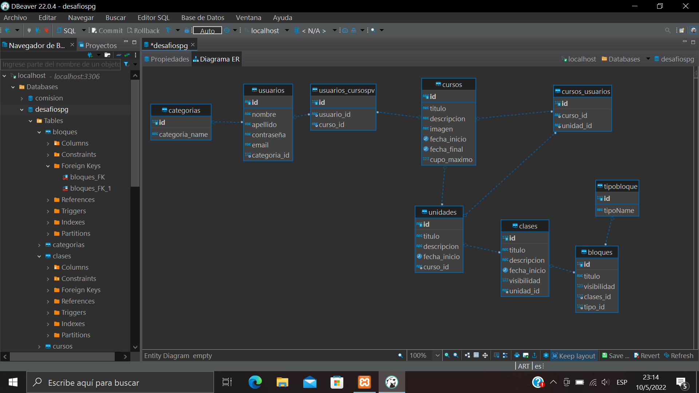

### Diagrama Entidad Relacion
#### Para todo desarrollo necesitamos una buena planificación. En esta práctica, diseñé las tablas para la base de datos. Base de datos relacional!
#### Como primer paso, lo más importante fue pensar en la lógica de lo que se desea desarrollar, para luego poner manos a la obra. Por otro lado, usando MySQL creamos las tablas, sus relaciones y por supuesto, sus datos. Y así quedo mi primer DB relacional:
